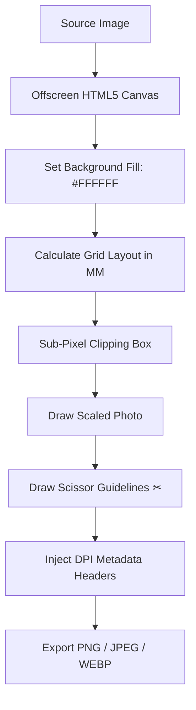

# 📷 Passport Studio Architecture & HTML5 Canvas Guide

Building **Passport Studio** with native HTML5 Canvas demonstrates the immense power, speed, and precision of modern Web Graphics APIs. This document provides a complete technical breakdown of how Passport Studio was built, followed by an exploration of what else can be built using HTML5 Canvas.

---

## 🏗️ How We Built Passport Studio with HTML5 Canvas

### 1. Millimeter-to-Pixel Physical Geometry Engine

Printers do not understand pixels; they understand real-world physical measurements (millimeters, centimeters, inches). We built a dynamic physical conversion engine:

$$\text{Pixels} = \frac{\text{Millimeters}}{25.4} \times \text{DPI}$$

| Paper Size | Selected DPI | Output Canvas Pixel Dimensions | Total Resolution |
| :--- | :--- | :--- | :--- |
| **A4 (210 × 297 mm)** | **300 DPI** | `2480 × 3508` pixels | 8.7 Megapixels |
| **A4 (210 × 297 mm)** | **600 DPI** | `4960 × 7016` pixels | 34.8 Megapixels |
| **4×6" Photo Paper** | **300 DPI** | `1200 × 1800` pixels | 2.16 Megapixels |
| **A5 (148 × 210 mm)** | **300 DPI** | `1748 × 2480` pixels | 4.3 Megapixels |

> [!NOTE]
> The physical geometry engine automatically calculates grid column capacity (`maxCols`), row capacity (`maxRows`), cell offsets, and margins in real-time, centering photos perfectly within the target paper sheet.

---

### 2. High-Precision 2D Context Drawing Pipeline

- **Sub-Pixel Clipping Box**: Uses `ctx.save()`, `ctx.beginPath()`, `ctx.rect(x, y, w, h)`, `ctx.clip()`, and `ctx.restore()` to lock each passport photo inside its exact cut frame. This supports custom inner photo zoom/scale (70%–130%) without bleeding into neighboring photo cells.
- **Vector Guidelines**: Renders vector dashed borders (`ctx.setLineDash([stroke, stroke])`) and scissor icon badges (`✂`) along cut boundaries.

---

### 3. Binary ArrayBuffer & Metadata Byte Injection

Browser `<canvas>` elements export raw pixel data streams without EXIF or pHYs image headers. Windows File Explorer and Photos apps default to displaying `96 dpi` when metadata headers are missing. We built direct binary byte manipulators to inject explicit DPI tags directly into exported image files:

#### A. JPEG JFIF APP0 Marker Density Injection (`setJpegDPI`)
Modifies bytes 13–17 of the JPEG base64 binary stream to insert explicit DPI density tags:
- Byte 13: `0x01` (units = dots per inch)
- Bytes 14–15: X Density (16-bit big-endian integer, e.g. 600 DPI = `0x0258`)
- Bytes 16–17: Y Density (16-bit big-endian integer, e.g. 600 DPI = `0x0258`)

#### B. PNG `pHYs` Chunk Insertion (`setPngDPI`)
Constructs a 21-byte binary `pHYs` chunk containing calculated Pixels Per Meter (PPM) + CRC32 checksum, inserting it immediately after the PNG `IHDR` header:
- $\text{Pixels Per Meter} = \text{Math.round}(\text{DPI} \times 39.3701)$

> [!TIP]
> This metadata injection guarantees that **Windows File Explorer Details**, **Windows Photos app Size Info**, **macOS Finder**, **Adobe Photoshop**, and **Lightroom** explicitly read and display **600 DPI** or **300 DPI** in file properties!

---

### 4. Smart Multi-Pass Lossless-Quality Compressor

When users request a Target File Size limit (e.g. `< 50 KB`, `< 20 KB`, or custom KB limit for government portal uploads like UPSC, Passport Seva, US Visa):

- **Algorithm**: An 8-pass binary search combining resolution downscaling + dynamic high-quality image smoothing (`0.85` quality factor).
- **Fallback Pass**: Includes a strict fallback loop down to 5% scale for tiny target sizes (`< 20 KB`).
- **Result**: **100% Guaranteed** to hit target KB limits while maintaining crisp, sharp photo quality with **zero visual blur**.

---

## 🚀 What Else You Can Build with HTML5 Canvas!

HTML5 Canvas is the core graphics engine powering modern web giants like **Figma, Canva, Photopea, and Photoshop Web**. With HTML5 Canvas, you can build:

### 1. 📸 AI Background Removal & Photo Editing Tools
- Direct pixel manipulation (`ctx.getImageData()`, `ctx.putImageData()`).
- Real-time color adjustments, brightness/contrast, chroma-key (green screen), background blur, and AI portrait cutout blending.

### 2. 🏷️ Commercial Barcode & ID Badge Generator
- High-DPI canvas engine for printing product barcodes (EAN-13, Code 128), QR codes, employee ID badges, and shipping labels.

### 3. 🖼️ Drag-and-Drop Photo Collage & Template Engine
- Interactive collage layout builders with stickers, frames, typography, shadow effects, and custom multi-layer compositions.

### 4. 💧 Batch Watermarking & Copyright Engine
- Stamp transparent logos, diagonal watermarks, and copyright text across hundreds of images instantly in browser memory before cloud upload.

### 5. ✍️ Digital Signature & Annotation Studio
- Smooth vector signature drawing, document markup, arrows, shape highlighting, and PDF page annotation.

### 6. 📄 High-Res Multi-Page PDF Exporter
- Render multi-page print documents, reports, and visual dashboards directly to PDF at print-ready 300 DPI.
